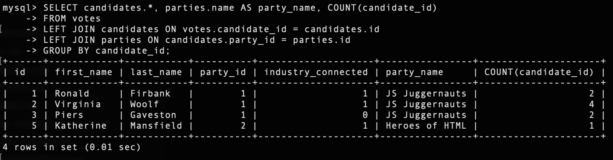
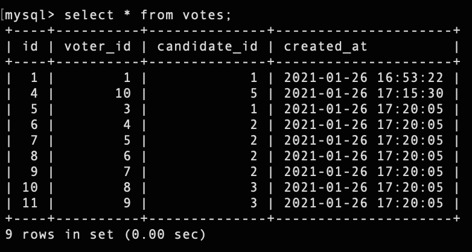

# u-develop-it

## Description :

U DEVELOP IT group is creating voting app where they need me to join the back-end development team. It require to use MYSQL database to store and retrieve records that are related to each other

```
* The requirement from the group include as below :

1. Use MySQL to crearte a database
1. Use SQL to create and polulate a table of data
1. Run SQL queries to create, read, update and delete from a table

## Languages and other components used : 
```
   * Node.js 
   * npm (node package manager) 
   * Expess.js server ( Node based web server ) 
   * routes ( GET, POST, DELETE, PUT ) 
   * middleware ( to accept incoming data )
   * MySQL (Structured Query Language)
   * MySQL2
```

## How to install : 
 ```
 To install the application in your computer follow the steps below: 

 1. Clone the repository in your computer :
    - open the command line and go to the directory where you want to clone the repository.
    - then clone the repo by typing : " git clone git@github.com:miraj00/u-develop-it.git "

 2. Install MySQL in your computer. 

 3. Install node.js on your computer by going to https://nodejs.org/en/  
  
 4. Once node.js is installed, type "npm init" on the cammand line Terminal at root directory.
    - This will initiate npm packages

 5. Create Express.js server by typing : "npm install express" on the command line

       After that, you can run " npm start " in terminal's root directory and make sure it shows the message " API server now on port 3001! " in the console.

 6. Install MySQL2 by typing : " npm install --save mysql2 " in command line

 7. Install Jest by typing : " npm install jest --save-dev " in command line

 8. You can use " mysql -u root -p " to start MySQL Server and " exit " or " Quit " to stop the server

 9. Use " npm start " or " node server.js " to start application  and " ctrl + c " to stop the applicatipon

 8. Once above steps are done, the application is ready to use.
```

```
## Below is the screenshot and Deployed application of the Project as per client request ## 






[Please click here to deploy application in Github](https://github.com/miraj00/u-develop-it)